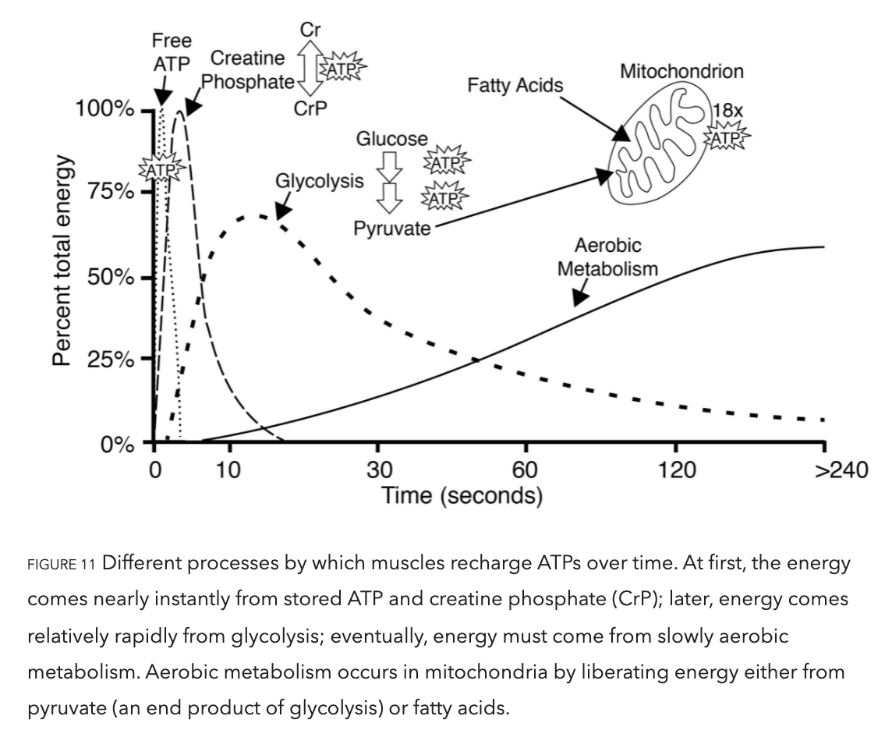
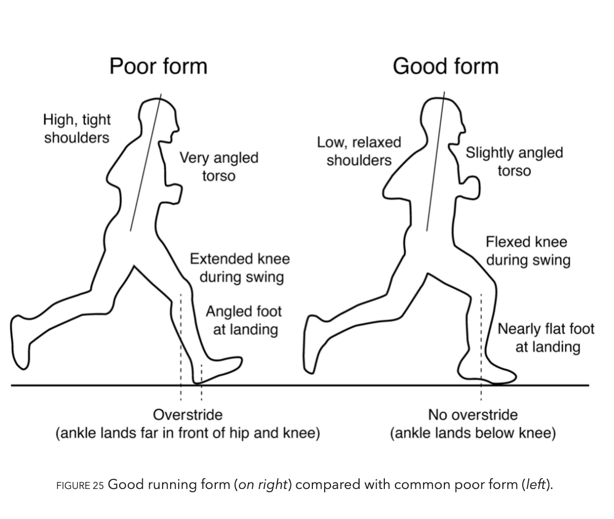

# Exercised: Why Something Never Evolved To Do Is Health And Rewarding

Author: Daniel E. Lieberman

To understand better this fascinating but speed-limiting system that only evolution could have devised, let’s imagine that Usain Bolt and I are simultaneously running from that hyena in Kenya. Although Bolt will initially sprint much faster than I, he, too, will gasp for breath after about thirty seconds because we recharge ATPs using the same three processes (schematized in figure 11) that work one after the next on different timescales—immediate, short-term, and long-term—but that have to compromise between speed and stamina.

The first process (called the phosphagen system) provides energy fastest but most fleetingly. As Bolt and I start running, our muscle cells contain barely enough ATPs to power a few steps. It seems inadvisable to stockpile so little ATP, but these organic batteries, despite being minuscule, store only one charge each, and they are too bulky and heavy for cells to manufacture and store in large quantities. You use more than thirty pounds of ATP during a one-hour walk and more than your entire body weight of ATP over the course of a typical day—an obviously impossible amount to lug around in reserve.15 Consequently, a human body stores in toto only about a hundred grams of ATPs at any given moment.16 Fortunately, before our first few steps deplete the leg muscles’ scant supply of ATPs, they quickly tap into another ATP-like molecule known as creatine phosphate that also binds to phosphates and stores energy.17 Unfortunately, those creatine phosphate reserves are also limited, becoming 60 percent depleted after ten seconds of sprinting and exhausted after thirty seconds.18 Even so, the precious short burst of fuel they provide gives muscles time to fire up a second energy recharging process: breaking down sugar.

Sugar is synonymous with sweetness, but it’s first and foremost a fuel used to recharge ATPs through a process termed glycolysis (from glyco for “sugar” and lysis for “break down”). During glycolysis, enzymes swiftly snip sugar molecules in half, liberating the energy from those bonds to charge two ATPs.19 Restoring ATPs from sugar doesn’t require oxygen and is rapid enough to provide almost half the energy used during a thirty-second sprint.20 In fact, a fit human can store enough sugar to run nearly fifteen miles. But there is a consequential catch: during glycolysis the leftover halves of each sugar, molecules known as pyruvates, accumulate faster than cells can handle. As pyruvates pile up to intolerable levels, enzymes convert each pyruvate into a molecule called lactate along with a hydrogen ion (H+). Although lactate is harmless and eventually used to recharge ATPs, those hydrogen ions make muscle cells increasingly acidic, causing fatigue, pain, and decreased function.21 Within about thirty seconds, a sprinter’s legs feel as if they are burning. It then takes a lengthy period of time to slowly neutralize the acid and shuttle the surplus lactate into the third, final, but long-term aerobic energy process.

Life demands oxygen, especially if you want to run far. In fact, using oxygen to burn a molecule of sugar yields a whopping eighteen times more ATP than glycolysis. But, once again, there is a trade-off: aerobic metabolism provides substantially more energy but substantially more slowly because it requires a long sequence of steps and an army of enzymes.22 These steps occur within specialized structures in cells known as mitochondria that are capable of burning not only the pyruvates that come from sugar but also fats and, in emergencies, proteins. Sugars and fats, however, are burned at different rates. Although my body stores enough fat to run about thirteen hundred miles, fat takes many more steps, hence much more time, to break down and burn than sugar. At rest, about 70 percent of a body’s energy comes from slowly burning fat, but the faster we run, the more sugar we must burn. At maximum aerobic capacity we burn exclusively sugar.

We can now understand why some people can run faster than others over long distances. While Bolt can sprint ridiculously faster than I can by literally hitting the ground harder, the farther we go, the more of an advantage I would probably have over him if we ever raced. That’s because everyone’s aerobic system kicks in when they start exercising, but the maximum level of energy obtained this way varies highly from person to person. This important limit, illustrated in figure 12, is termed maximal oxygen uptake, or VO2 max. Having your VO2 max measured can be a little scary. Typically, you are fitted with a mask connected to a machine that measures oxygen consumption (as described in chapter 2) while you run on a treadmill. As the treadmill goes faster and faster, you use more and more oxygen until your ability to use any additional oxygen plateaus and you start to gasp. At this limit, your VO2 max, you need glycolysis to supply additional fuel to your muscles. Speeds above this range cannot be sustained, because muscles become acidic. Fortunately, your VO2 max has little effect on speed during short bursts of maximum intensity, such as a thirty-second sprint, but the longer the distance, the more it matters. For a hundred-meter dash, only 10 percent of your energy comes from aerobic respiration, but that percentage increases to 30 percent over four hundred meters, 60 percent for eight hundred meters, and 80 percent for a mile.23 The farther you go, the more your maximum speed benefits from a high VO2 max (which, as we will see, you can increase by training).24

At long last, we can now appreciate why Bolt and I, not to mention that hyena, inevitably trade off energy to go either fast or far. Although Bolt leaves me in the dust when sprinting, we both quickly burn through our scanty ATP and creatine phosphate stores while we ramp up our glycolysis rate to maximum levels. Because we both sprint above our VO2 max, we both have to stop after about thirty seconds and pant to recharge our molecular batteries and clear the acid from our muscles.25 If, heaven forbid, the hyena keeps chasing us before we recover, we would need to rely more heavily on our aerobic systems and thus run more slowly. The longer the chase, the better I might do relative to Bolt because I probably have more endurance.

[On the decrease in size and aggression in human evolution] A more speculative hypothesis is that the invention of the bow and arrow and other cutting-edge projectile technologies revolutionized the costs and benefits of reactive aggression. For the first time, slight Davids like me could take down Goliaths, and females could defend themselves more effectively against male aggressors. Weapons like the bow and arrow also helped less brawny individuals hunt effectively and with reduced risk at a distance. Since the bow and arrow was invented 100,000 years ago, it has probably been less advantageous to be big and reactively aggressive.67 Wouldn’t it be ironic if the evolution of projectile weapons helped domesticate humans? I suspect less reactive aggression also helped spur the evolution of another human universal: sports.

## Good running form

1. Avoid overstriding. Get your knees up when you swing your legs forward so you land with a vertical shank and your foot below the knee, not too far in front of the hips. This prevents the legs from landing too stiffly and causing overly high breaking forces that slow you down.

2. Step rate usually increases with speed, but experienced endurance runners generally take 170–180 steps a minute regardless of speed. They thus speed up economically by jumping farther (running is jumping from one leg to another), and a high step rate prevents overstriding.

3. Lean forward slightly, but not too much at the waist. Too much upper-body lean requires you to spend more energy preventing your torso from toppling forward, and it encourages overstriding.

4. Land gently with your feet nearly horizontal. If you are barefoot and don’t overstride, it is almost impossible not to land on the ball of your foot before letting down your heel in what is called a forefoot or mid-foot strike. Forefoot and mid-foot strikes usually don’t generate an impact peak on the ground—a rapid, large collisional force that is painful without shoes. Forefoot and mid-foot strikes also generate rotational forces (torques) that are lower in the knee but higher in the ankle, requiring strong calf muscles and Achilles tendons, which can lead to problems for people trying to transition to this way of running. If you change how your foot lands, do so gradually and build up strength.

