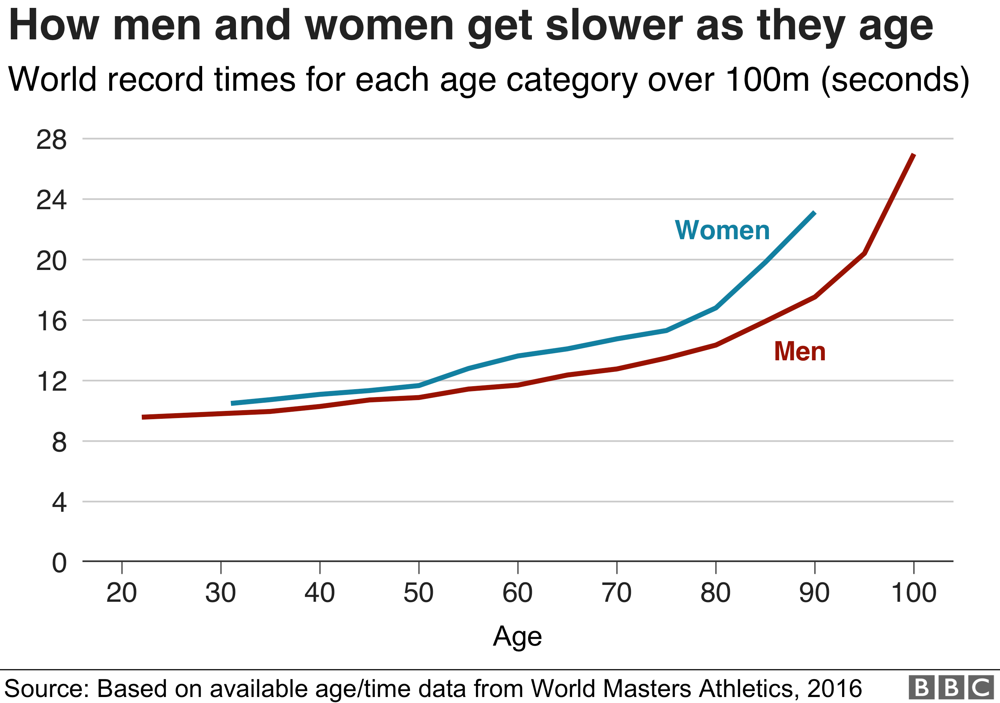

# Keep Sharp

Author: Sanjay Gupta

## Are you at risk? p21

1. Do you suffer from any brain-related ailment now, or have you been diagnosed with mild cognitive impairment?
2. Do you avoid strenuous exercise?
3. Do you sit for most of the day?
4. Are you overweight or even obese?
5. Are you a woman?
6. Have you been diagnosed with cardiovascular disease?
7. Do you have any metabolic disorders such as high blood pressure, insulin resistance, diabetes, or high cholesterol?
8. Have you ever been diagnosed with an infection that can lead to chronic inflammation and can have neurological effects (eg., Lyme disease, herpes, syphilis)?
9. Do you take certain medications with known possible brain effects, such as antidepressants, antianxiety drugs, blood pressure drugs, statins, proton pump inhibitors, or antihistamines?
10. Have you ever experienced a traumatic brain injury or suffered head trauma from an accident or playing an impact sport? Have you ever been diagnosed with a concussion?
11. Do you smoke or have a history of smoking?
12. Do you have a history of depression?
13. Do you lack social engagement with others?
14. Did your years of formal education end at high school or earlier?
15. Is your diet high in processed, sugary, fatty foods and low in whole grains, fish, nuts, olive oil, and fresh fruits and vegetables?
16. Do you live with chronic, unrelenting stress? (Everyone has stress. This is stress that seems to be constant or present more often than not and that you have trouble coping with.)
17. Do you have a history of alcohol abuse?
18. Do you suffer from a sleep disorder(e.g., insomnia, sleep apnea) or otherwise experience poor sleep on a regular basis?
19. Do you have hearing loss?
20. Does your day lack cognitive challenges in the form of learning something new or playing a game that requires a lot of thinking?
21. Does your job lack complex work with people in the form of persuasion, mentoring, instruction or supervision?
22. Are you over sixty-five years old?
23. Does Alzheimer's disease "run in your family", or have you been diagnosed with carrying the "Alzheimer's gene variant," APOE3 or APO34, or both?
24. Do you care for someone who suffers from some form of dementia, Alzheimer's disease included?

If you answered yes to five or more questions, then your brain could be in decline or may be soon, and you can benefit tremendously from the information in this book. Even if you answered yes to only one or two questions, you can help optimize the health and performance of your brain for the better.

p75 BrainSpan, a company and laboratory that develops products and programs to help people measure, track, and improve brain function.

## 12 Destructive myths about the brain

1. The brain remains a complete mystery
2. Older people are doomed to forget things
3. Dementia is an inevitable consequence of old age
4. Older people can't learn new things
5. You must master one language before learning another
6. A person who has memory training never forgets
7. We use only 10% of our brains
8. Male and female brains differ in ways that dictate learning abilities and intelligence
9. A crossword puzzle a day can keep the brain doctor away
10. You are dominated by either your "right" or "left" brain
11. You have only five senses. List of senses:
    * Proprioception: where your body parts are, and what they are doing
    * Equilibrioception: balance & friends
    * Nociception: pain
    * Thermo(re)ception: temperature
    * Chronoception: sensing the passage of time
    * Interoception: internal needs like hunger, thirst, or needing the bathroom
    * Ophtalmoception: sight
    * Olfacoception: smell
    * Gustaoception: taste
    * Tactioception: touch
    * Audioception: hearing
12. You're born with all the brain cells you'll ever have, your brain is hardwired, and brain damage is always permanent.

## How not to lose your mind

Among people who are 85 years old, an age at which more than 30 percent have developed dementia, signs of brain decline began silently when they were between fifty-five and sixty-five years old. Similarly, the brain health of the 10 percent or so of people who are sixty-five years old and have developed dementia started to quietly degenerate when they were between thirty-five and forty-five years old. In other words of one prominent neurologist, "Alzheimer's disease may be more aptly termed a younger and middle-aged person's disease".

### The miracle of movement

Fitness could very well be the most important ingredient to living as long as possible, despite all the other risk factors you bear - age and genetics included. And while it may seem hard to believe, exercise in the only behavioral activity scientifically proven to trigger biological effects that can help the brain.

Contrary to what you might think, we don't get that much slower with age until we reach seventy. And we can gain a lot more than we previously realized from relatively low-intensity activities like walking, gardening, or ballroom dancing.

Physical inactivity has been calculated to be the most significant risk factor in cognitive decline and the development of dementia.

Simply being inactive, regardless of your body weight, has been shown to be twice as deadly as being obese. [...]

Prolonged sitting - more than eight hours a day with zero physical activity - can kill you or lead to an early death. Most of the damage is metabolic. Here is what happens. When you are immobile, your circulation slows down and your body uses less of your blood sugar, which means more sugar is circulating. Being motionless also negatively influences blood fats, high-density lipoprotein (the good cholesterol), resting blood pressure, and the satiety hormone leptin (which tells you when to stop eating). Sitting puts muscles into a sort of dormant state where their electrical activity is diminished, leading to atrophy and breakdown. Moreover, the production of lipoprotein lipase, the enzyme that breaks down fat molecules in the blood, is shut down, leading to more fat circulating as well. As your metabolic rate plummets, you stop burning as many calories. [...]

Getting up for light activity such as walking for two minutes every hour was associated with a 33 percent lower chance of dying over a three-year period. Two minutes!

### Moving through evolution

Throughout most of human history, we've been physically active every day. We had to be in order to survive. Science has even proven that over millions of years, our genome evolved in a state of constant physical challenge - that is, it took a massive amount of physical effort to find food and water. Put another way, our genome *expects* and *requires* frequent movement. I often tell my students: "We humans were not designed to sit or lie down for twenty-three hours a day and the go to the gym for an hour. Science has revealed that we humans are designed to be pretty consistently active right down to our molecular core".

In his book, *The Story of the Human Body*, Dr. Lieberman makes a strong case that our epidemic levels of chronic disease today are the result of a mismatch between our evolutionary roots and modern lifestyles: "We still don't know how to counter once-adaptive primal instincts to eat donuts and take the elevator." In a follow-up paper, Lieberman calls out the paradox: "Humans evolved to be adapted for regular, moderate amounts of endurance physical activity into late age," but "humans also were selected to avoid unnecessary exertion". The secret to a good long life starts with exercise: "Men and women aged forty-five to seventy-nine who are physically active, eat plenty of fruits and vegetables, do not smoke, and consume alcohol moderately have on average one-fourth the risk of death during a given year than people with unhealthy habits". This should inspire you because these bits of advice are practical. Anyone can follow them.

#### How exercise benefits the brain

A big factor is the control of blood sugar through exercise. Using sugar to fuel your muscles instead of sitting idle in your blood helps prevent dramatic glucose and insulin fluctuations that you have already learned increase the risk for dementia. Exercise also helps lower inflammation and that is critical in preventing dementia. Considers these other benefits:

* Lowered risk of death from all causes
* Increase stamina, strength, flexibility, and energy
* Increased muscle tone and bone health
* Increased blood and lymph circulation and oxygen supply to cells and tissues
* More restful, sounder sleep
* Stress reduction
* Increased self-esteem and sense of well-being
* Release of endorphins, the brain chemicals that act as natural mood lifters and pain relievers
* Decreased blood sugar levels and risk for insulin resistance and diabetes
* Ideal weight distribution and maintenance
* Increased heart health, with lower risk for cardiovascular disease and high blood pressure
* Decreased inflammation and risk for age-related disease, from cancer to dementia
* Stronger immune system

### Shaper your brain by getting into shape

The biology of how exercise benefits brain health goes far beyond the reasoning that it facilitates oxygenated blood flow, delivering nutrients for neural cell growth and maintenance. [...] For one, exercise effectively uses circulating blood sugar and reduces inflammation while stimulating the release of growth factors, substances that promote both the proliferation and function of cells. In the brain, these growth factors support the health of new neurons, the recruitment of blood vessels, and the survival of all neurons. The other way that exercise can benefit the brain may seem a little less objective, but it is no less important. We now know that regular movement measurable reduces stress and anxiety while improving sleep and mood - all of which can also positively affect brain structure and function. These combined effects build critically important brain resilience in the long term and help pave the way for us to be creative and insightful and to solve problems in the short term.

Exercise can act as a "first aid kit" for damaged brain cells, speeding up recovery after injury, stroke, or a significant emotional stress. I don't know of a single pill that can do all that.

Chronic stress and elevated levels of cortisol can also negatively affect memory and learning in surprising ways.

High blood sugar can lead to dementia for several reasons. For starters, the condition can weaken the blood vessels and thus increase the likelihood of mini-strokes in the brain, which can then trigger various forms of dementia.

### Just as your would brush your teeth

"Exercise" includes a combination of purposeful aerobic cardio work (e.g., swimming, cycling, jogging, group exercise classes), strength training (e.g., free weights, resistance bands, gym machines, mat Pilates, lunges, squats), and routines that promote flexibility and balance (e.g., stretching, yoga, tai-chi)). It also includes leading a physically active life throughout the day (e.g., taking the stairs instead of the elevator; avoiding prolonged sitting; going for walks during breaks; engaging in hobbies such as dancing, hiking, and gardening).
